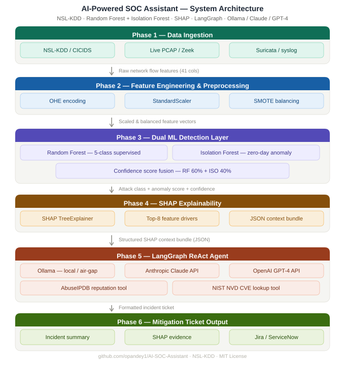
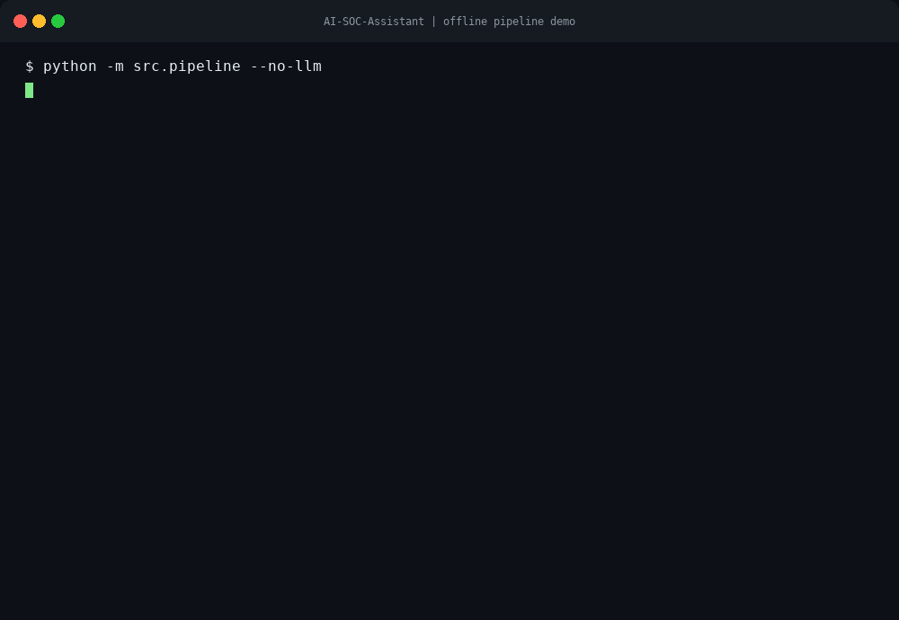
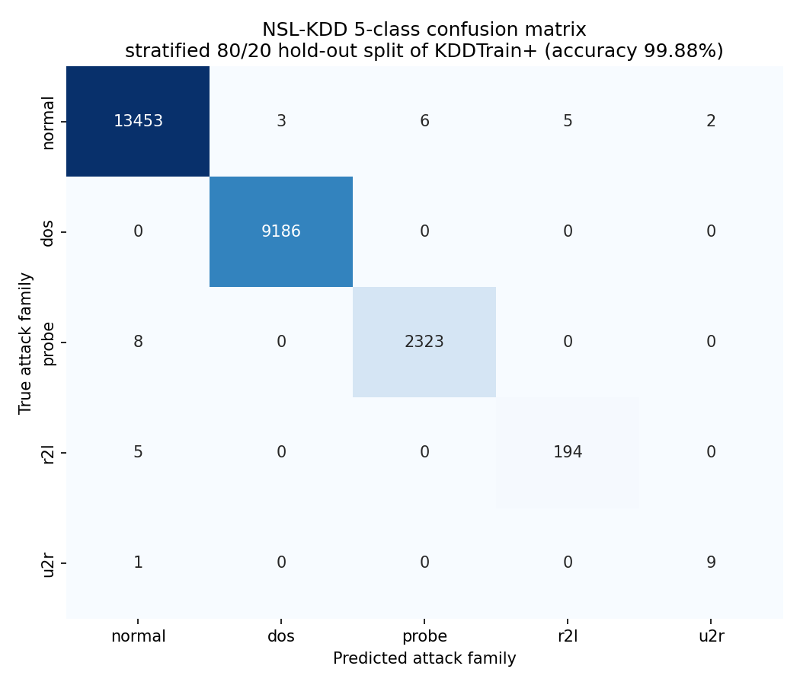
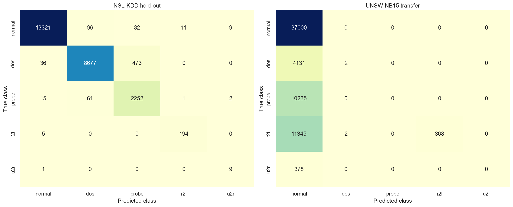
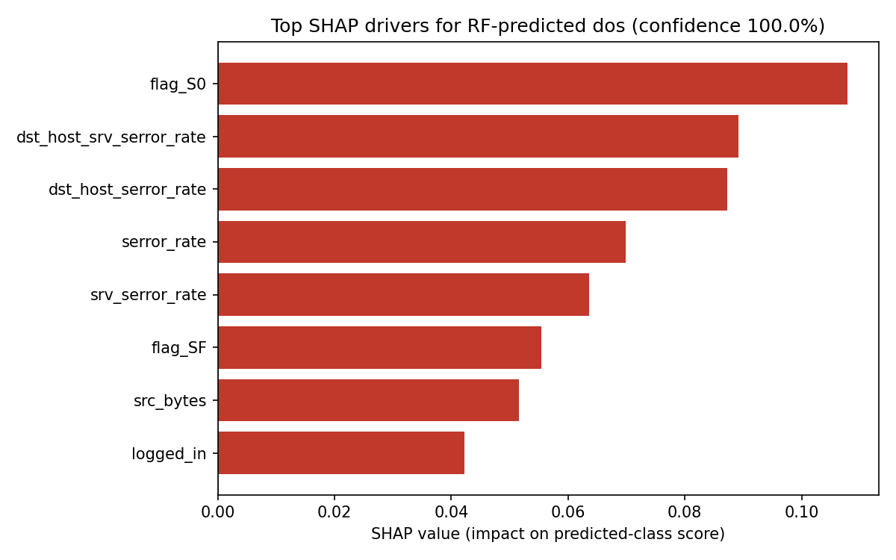
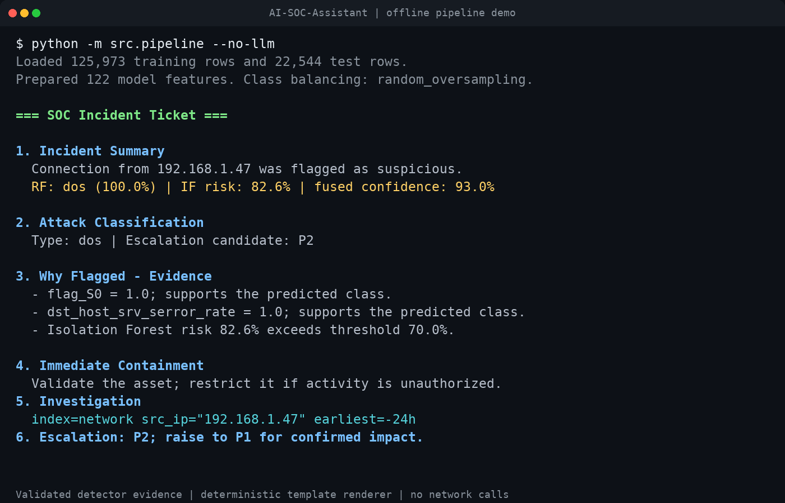

# AI-Powered SOC Assistant

An explainable AI triage pipeline that classifies NSL-KDD network connections into specific attack families, fuses supervised and unsupervised anomaly signals, and generates analyst-ready SOC incident tickets with GenAI.

[](https://github.com/opandey1/AI-SOC-Assistant/actions/workflows/ci.yml)
[](https://www.python.org/)
[](LICENSE)
[](https://www.unb.ca/cic/datasets/nsl.html)
[](https://colab.research.google.com/github/opandey1/AI-SOC-Assistant/blob/main/notebooks/AI_Powered_SOC_Assistant.ipynb)



> **Multi-class detection is the moat.** Unlike traditional binary "anomaly / not anomaly" SOC classifiers, this pipeline uses a native 5-class Random Forest to categorize specific attack families — **Normal, DoS, Probe, R2L, and U2R** — and explains every individual prediction with SHAP. That family-level verdict is what turns a raw alert into an actionable, triaged ticket.

## See It Run



## Why This Is Different

- **Native multi-class SOC detection:** Specific attack families (Normal, DoS, Probe, R2L, U2R) instead of a single binary anomaly flag.
- **Dual-model triage:** A Random Forest predicts the attack family while an Isolation Forest adds an unsupervised anomaly signal for suspicious traffic patterns.
- **Explainable evidence:** SHAP identifies the strongest feature drivers for each flagged connection and passes analyst-readable values into the ticket.
- **Live analyst workflow:** Delayed replay and Kafka-compatible ingestion feed the same classifier, SHAP explainer, SQLite review queue, and Streamlit console.
- **Human-in-the-loop learning:** Reviewed false positives become weighted correction examples in a versioned Random Forest artifact.
- **Local-first GenAI:** Deterministic template mode makes no network calls. Ollama keeps the LLM prompt on the configured local server, and external threat-intelligence lookups are disabled unless explicitly enabled.
- **Operational output:** The final response is a structured incident ticket with containment steps and copy-pasteable Splunk SPL queries.

## Results & Metrics

Evaluated on a **stratified 80/20 hold-out split of `KDDTrain+`** (deterministic random oversampling applied to the training fold only). Regenerate everything below with `python -m src.evaluate`.

| Attack family | Precision | Recall | F1-score | Support |
| --- | --- | --- | --- | --- |
| `normal` | 0.999 | 0.999 | 0.999 | 13,469 |
| `dos` | 1.000 | 1.000 | 1.000 | 9,186 |
| `probe` | 0.997 | 0.997 | 0.997 | 2,331 |
| `r2l` | 0.975 | 0.975 | 0.975 | 199 |
| `u2r` | 0.818 | 0.900 | 0.857 | 10 |

**Overall accuracy: 99.88% · Macro F1: 0.9655 · Weighted F1: 0.9988**



> **Honest generalization note.** `KDDTest+` is deliberately constructed to contain novel attack variants not present in training, so cross-distribution accuracy drops to **74.40%** (macro F1 0.5149), with recall on the rare `r2l` and `u2r` families being the hardest. Reproduce this harder evaluation with `python -m src.evaluate --use-test-set`. The external UNSW-NB15 result below shows that the remaining domain shift is substantially harder.

### External Transfer Validation

The zero-tuning UNSW-NB15 benchmark trains a separate Random Forest on **seven shared or closest-compatible flow fields from NSL-KDD only**, then evaluates 63,461 supported UNSW-NB15 test flows. `Generic` attacks are excluded because this project's five-family taxonomy has no defensible equivalent.

| Protocol | Accuracy | Balanced accuracy | Macro F1 | Binary attack F1 |
| --- | ---: | ---: | ---: | ---: |
| NSL-KDD common-feature hold-out | 97.05% | 95.49% | 87.97% | 99.13% |
| UNSW-NB15 zero-tuning transfer | 58.89% | 20.64% | **16.02%** | **2.77%** |



This is a **negative but useful result**: the model largely collapses to `normal` under the newer capture environment. It demonstrates why the NSL-KDD headline score is not a production claim and establishes a reproducible baseline for a future Zeek/SIEM feature adapter and modern-data retraining. See the [full transfer report](docs/evaluation/unsw_transfer/metrics.md) and [machine-readable metrics](docs/evaluation/unsw_transfer/metrics.json).

## Explainability in Action

For every flagged connection, SHAP ranks the features that drove the prediction and the pipeline forwards their **real, unscaled network values** (not z-scores) into the ticket. These contributions explain what supported or opposed the model's predicted class; they are not treated as independent causal proof of a specific attack technique.



Those drivers become plain-English evidence in the generated ticket:



```text
3. Why Flagged - Evidence
- Isolation Forest signal: risk 82.6% (configured threshold 70.0%);
  raw decision score -0.111155, where lower values are more anomalous.
- flag_S0: observed value 1.0; supports the predicted class.
- dst_host_srv_serror_rate: observed value 1.0; supports the predicted class.
- dst_host_serror_rate: observed value 1.0; supports the predicted class.
```

See the full [sample ticket](docs/sample_ticket.md) and the underlying [SHAP evidence bundle](docs/evaluation/holdout/shap_example_output.json).

## MITRE ATT&CK Mapping

Each detected attack family maps to a MITRE ATT&CK tactic, giving analysts a shared frame of reference for triage and escalation.

| Attack family | MITRE ATT&CK tactic | Tactic ID | Representative techniques |
| --- | --- | --- | --- |
| `dos` | Impact | [TA0040](https://attack.mitre.org/tactics/TA0040/) | Network Denial of Service (T1498), Endpoint DoS (T1499) |
| `probe` | Discovery | [TA0007](https://attack.mitre.org/tactics/TA0007/) | Network Service Scanning (T1046), System Network Discovery (T1016) |
| `r2l` | Initial Access | [TA0001](https://attack.mitre.org/tactics/TA0001/) | Valid Accounts (T1078), Exploit Public-Facing Application (T1190) |
| `u2r` | Privilege Escalation | [TA0004](https://attack.mitre.org/tactics/TA0004/) | Exploitation for Privilege Escalation (T1068), Abuse Elevation Control (T1548) |
| `normal` | — | — | Benign baseline traffic |

## Quickstart

Use CPython **3.10, 3.11, or 3.12**. Other versions are not part of the supported or CI-tested matrix.

```bash
git clone https://github.com/opandey1/AI-SOC-Assistant.git
cd AI-SOC-Assistant
python -m venv .venv
source .venv/bin/activate
python -m pip install --upgrade pip
python -m pip install -r requirements.txt
python -m pip check
```

On Windows PowerShell, activate the environment with `.\.venv\Scripts\Activate.ps1` instead. Then place `KDDTrain+.txt` and `KDDTest+.txt` in `data/`; see [data/README.md](data/README.md) for the official source, reference checksums, and verification procedure.

Run the deterministic offline path:

```bash
python -m src.pipeline --no-llm
```

This path uses the template ticket renderer and performs no LLM or threat-intelligence network calls.

### Analyst console

Launch the Streamlit triage, SHAP, ticket-review, and model-operations console:

```bash
streamlit run streamlit_app.py
```

The console reads the same NSL-KDD files, persists alert tickets to `state/soc_feedback.db`, and automatically offers `models/soc_model.joblib` after feedback retraining.

### Live event ingestion

Replay test connections one event at a time with a visible delay:

```bash
python -m src.streaming replay --limit 10 --delay 0.5
```

Run a Kafka-compatible broker, consumer, and delayed publisher with the pinned Redpanda Compose profile:

```bash
docker compose --profile streaming up --build
```

The Kafka topic uses a documented JSON envelope containing event metadata plus all 41 NSL-KDD model-input fields. The consumer trains once, scores continuously, and stores generated alert tickets in SQLite. To connect to another broker, use `python -m src.streaming consume --bootstrap-servers HOST:PORT` and `python -m src.streaming publish --bootstrap-servers HOST:PORT`.

### Analyst feedback and retraining

Review tickets from the console or CLI, then update the Random Forest:

```bash
python -m src.feedback list --state unreviewed
python -m src.feedback review 1 --disposition false_positive --corrected-class normal
python -m src.retrain
python -m src.streaming replay --model models/soc_model.joblib --limit 10 --delay 0
```

Reviews are append-only for auditability. Retraining leaves the Isolation Forest fixed, gives reviewed corrections an explicit sample weight, writes an atomic/versioned model artifact, and reports both correction behavior and whole-test metrics. The validated example changed a ground-truth normal row from `probe` to `normal`, raising corrected-class probability from **2.83% to 50.22%**; see the [feedback update report](docs/evaluation/feedback_retraining/metrics.md).

### External dataset benchmark

Download the checksum-verified UNSW-NB15 test partition and regenerate the transfer report:

```bash
python scripts/download_unsw_nb15.py
python -m src.validate_unsw
```

The raw CSV is gitignored. Review the UNSW academic-use terms and citation guidance linked from [data/README.md](data/README.md).

### Optional LLM providers

To generate a ticket with a locally running Ollama server:

```bash
ollama pull mistral
SOC_LLM_PROVIDER=ollama python -m src.pipeline
```

PowerShell users can set the provider like this:

```powershell
$env:SOC_LLM_PROVIDER = "ollama"
python -m src.pipeline
```

OpenAI and Anthropic are also supported through `--provider openai` and `--provider anthropic`. Those providers send the prompt—including the connection evidence—to the selected external API. Configure the corresponding provider API key only after confirming that this is permitted for the telemetry being processed.

Threat-intelligence tools are disabled by default for every provider. To opt in, set `SOC_ENABLE_THREAT_INTEL=true`; this permits outbound AbuseIPDB and NVD requests and may disclose the source IP or service name to those services. AbuseIPDB additionally requires `ABUSEIPDB_API_KEY`. Leave the variable unset or false for local-only operation.

Regenerate the metrics, confusion matrix, and SHAP artifacts:

```bash
# Stratified hold-out protocol -> docs/evaluation/holdout/
python -m src.evaluate

# Cross-distribution protocol -> docs/evaluation/cross_distribution/
python -m src.evaluate --use-test-set
```

Regenerate the README ticket preview and animated terminal demo:

```bash
python scripts/generate_readme_assets.py
```

The committed metrics are produced with the supported Python range and the exact direct dependency versions in `requirements.txt`. Record the Python version, dependency inventory, dataset checksums, arguments, and random seed when publishing a comparison. Use `--use-test-set` for the separate `KDDTest+` cross-distribution protocol.

### Run with Docker

The default Compose service is the deterministic offline path. It does not start Ollama and runs with container networking disabled:

```bash
docker compose run --rm soc-assistant
```

Ollama is isolated behind an explicit profile, its API is published only on host loopback, and threat-intelligence lookups remain disabled:

```bash
docker compose --profile local-llm up -d ollama
docker compose --profile local-llm exec ollama ollama pull mistral
docker compose --profile local-llm run --rm soc-assistant-ollama
docker compose --profile local-llm down
```

Launch only the dashboard profile at `http://localhost:8501`:

```bash
docker compose --profile dashboard up --build dashboard
```

Dashboard tickets and retrained model artifacts persist in the named `soc-state` and
`soc-models` volumes. The streaming profile uses `redpanda-data` for broker state.

Pulling an image or model requires network access. After those artifacts are present locally, the pipeline prompt is sent only to the Ollama service configured in Compose. Do not enable `SOC_ENABLE_THREAT_INTEL` if the deployment must avoid external API calls.

### Tests

```bash
python -m pip install pytest==8.3.4 flake8==7.1.1 black==24.10.0
python -m black --check streamlit_app.py src tests scripts
python -m flake8 streamlit_app.py src tests scripts
python -m pytest
```

## Repository Structure

```text
src/
  ingest.py       NSL-KDD loading and attack-family mapping
  preprocess.py   one-hot encoding, scaling, and exact-row class balancing
  train.py        Random Forest, Isolation Forest, and fused scoring
  explain.py      SHAP explanation bundle generation
  agent.py        LangGraph SOC analyst agent and threat-intel tools
  evaluate.py     metrics, confusion matrix, and SHAP artifact generation
  feedback.py     SQLite ticket store and append-only analyst reviews
  model_store.py  atomic, versioned fitted-model artifacts
  pipeline.py     runnable command-line pipeline
  retrain.py      analyst-feedback Random Forest update
  runtime.py      shared single-connection analysis runtime
  streaming.py    delayed replay plus Kafka consumer/publisher
  validate_unsw.py  zero-tuning UNSW-NB15 transfer benchmark
scripts/
  generate_readme_assets.py   terminal GIF and ticket-preview generator
  download_unsw_nb15.py       checksum-verified external dataset downloader
streamlit_app.py  analyst triage, review queue, and model operations console
tests/            pytest unit tests for ingestion, preprocessing, SHAP, tickets
notebooks/
  AI_Powered_SOC_Assistant.ipynb
docs/             architecture, sample ticket, and protocol-scoped evaluation artifacts
.github/workflows/ci.yml   dependency checks, black, flake8, and pytest on Python 3.10-3.12
Dockerfile, docker-compose.yml
```

## Demo Artifacts

- [Long-term implementation record and reproducible commands](docs/LONG_TERM_IMPLEMENTATION.md)
- [Architecture diagram](docs/soc_architecture.svg)
- [Animated pipeline demo](docs/demo.gif) and [lightweight SVG version](docs/demo.svg)
- [Generated ticket preview](docs/ticket_preview.png)
- [Hold-out confusion matrix](docs/evaluation/holdout/confusion_matrix.png) and [per-class metrics](docs/evaluation/holdout/metrics.md)
- [Hold-out SHAP driver plot](docs/evaluation/holdout/shap_drivers.png) and [SHAP evidence bundle](docs/evaluation/holdout/shap_example_output.json)
- [Cross-distribution metrics](docs/evaluation/cross_distribution/metrics.md)
- [UNSW-NB15 transfer metrics](docs/evaluation/unsw_transfer/metrics.md) and [confusion matrices](docs/evaluation/unsw_transfer/confusion_matrix.png)
- [Analyst-feedback retraining example](docs/evaluation/feedback_retraining/metrics.md)
- [Sample generated ticket](docs/sample_ticket.md)
- [Evolution brief](docs/SOC_Assistant_Evolution.pdf)
- [Colab notebook](notebooks/AI_Powered_SOC_Assistant.ipynb)

## Roadmap / Future Work

The [Unified SOC project roadmap](docs/unified_soc_roadmap.md) treats this repository as the explainable ML pre-triage layer for a larger **MCP + Agentic-SOC** system. The implemented Kafka event contract, SHAP evidence bundle, SQLite verdict history, and versioned model artifact are the integration boundary for:

1. SIEM/Zeek schema adapters feeding live normalized connection events.
2. MCP tools exposing scoring, ticket retrieval, and analyst verdict operations.
3. An Agentic-SOC triage layer grounded by model confidence and SHAP evidence.
4. Kali MCP validation and Sigma-rule generation with human approval gates.
5. Validated true/false-positive outcomes returning to this repository's retraining loop.

The separate Agentic-SOC and Unified SOC design work is not yet published as a GitHub repository, so this README links to the versioned integration plan instead of a speculative or broken public URL.

## Evolution & Wins

### 1. Feature Engineering: Robust Categorical Encoding

**Initial state:** The pipeline used `LabelEncoder` for categorical network features such as protocol, service, and flag.

**Challenge:** `LabelEncoder` creates false mathematical ordinals and can crash when live traffic introduces a category not seen during training.

**Fix:** The preprocessing pipeline uses `OneHotEncoder(handle_unknown="ignore")`. Class balancing uses deterministic random oversampling of exact training rows, avoiding fractional categorical, binary, and integer telemetry values.

**Win:** The feature representation is resilient to novel service values, and balancing preserves valid telemetry domains without synthesizing impossible records.

### 2. Agent Orchestration: Migrating to LangGraph

**Initial state:** The assistant logic relied on older LangChain agent patterns.

**Challenge:** Modern tool-calling workflows benefit from clearer state handling and more reliable agent execution.

**Fix:** The agent layer uses `langgraph.prebuilt.create_react_agent` with the `state_modifier` system-prompt argument supported by the pinned LangGraph release.

**Win:** The orchestration layer is more maintainable and better aligned with current LangChain/LangGraph patterns.

### 3. Environment Constraints: Offline and Local LLM Execution

**Initial state:** LLM usage was tied to cloud provider calls.

**Challenge:** SOC environments often restrict transmission of raw telemetry, internal IPs, and security logs to external APIs.

**Fix:** `initialize_llm` supports Ollama, OpenAI, Anthropic, and template modes. The deterministic `--no-llm` path performs no model or threat-intelligence network calls, while external lookups require an explicit `SOC_ENABLE_THREAT_INTEL=true` opt-in.

**Win:** Template mode can run with networking disabled, while Ollama provides a local-model option for privacy-sensitive demos and restricted environments.

### 4. Threat Intel Integration: Fault-Tolerant API Tools

**Initial state:** Threat-intelligence tools were placeholders.

**Challenge:** Real APIs can fail, rate-limit, or return verbose nested payloads that overwhelm the LLM context.

**Fix:** AbuseIPDB and NVD lookups are disabled by default. When explicitly enabled, they use timeouts, input validation, explicit error handling, and compact response formatting.

**Win:** API failures become ticket context instead of Python process failures.

### 5. Explainable AI: Cross-Version SHAP Compatibility

**Initial state:** SHAP extraction assumed one output shape.

**Challenge:** SHAP has changed multi-class output formats across versions.

**Fix:** The explanation layer handles both legacy list outputs and newer 3D array outputs, maps class labels through the model's class ordering, and resolves evidence by feature name.

**Win:** The code is more portable across dependency versions.

### 6. Forensic Accuracy: Real-World Metrics

**Initial state:** The explanation bundle risked exposing scaled z-score values to the LLM.

**Challenge:** SOC analysts need real packet, byte, count, and rate values, not normalized model inputs.

**Fix:** Model inference still uses scaled values, while SHAP evidence includes the unscaled processed feature values.

**Win:** Generated tickets read like analyst evidence rather than model internals.

### 7. GenAI Guardrails: Eliminating Hallucinations & Over-Generation

**Initial state:** Smaller local models could drift into code snippets or raw floating-point SHAP values.

**Challenge:** The assistant must produce a tight incident ticket, not a generic explanation or script.

**Fix:** The system prompt enforces ticket-only output, while response validation rejects malformed sections, invalid SPL blocks, and raw SHAP leakage. Invalid provider output falls back to the deterministic renderer.

**Win:** The GenAI layer translates model evidence into actionable SOC workflow output.

### 8. Anomaly Scoring: Stable Calibration and Verdicts

**Initial state:** Isolation Forest risk was normalized against each test batch, and single-record ticketing used a different raw-score rule.

**Challenge:** The same connection could receive a different anomaly verdict depending on unrelated rows in the batch.

**Fix:** Calibration bounds are learned from training-normal traffic and reused for both batch scoring and single-connection ticketing. One threshold now drives the fused verdict everywhere.

**Win:** Alert selection, explanations, and generated tickets agree on why a connection was flagged.
