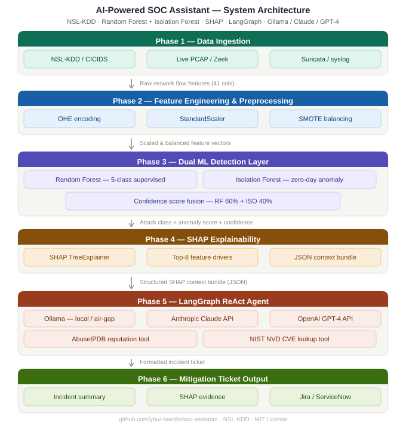

# AI-Powered SOC Assistant: Architectural Evolution & Wins

This document outlines the iterative engineering improvements, architectural pivots, and prompt engineering refinements made to transition the AI-Powered SOC Assistant from an educational notebook into a production-ready, enterprise-grade threat hunting pipeline.

This repo implements a full SOC triage pipeline — from raw NSL-KDD logs through a dual-ML detection layer to a GenAI-generated incident ticket. Designed for security engineers who want explainable, production-ready anomaly detection without external API dependencies.
SOC_LLM_PROVIDER=ollama python src/pipeline.py

## 1. Feature Engineering: Robust Categorical Encoding
* **Initial State:** The pipeline used `LabelEncoder` for categorical network features (protocol, service, flag).
* **The Challenge:** `LabelEncoder` creates false mathematical ordinals (e.g., instructing the model that TCP > UDP), which confuses tree-based models. Furthermore, it causes fatal crashes if live traffic introduces a novel/zero-day service not seen in the training data.
* **The Fix:** Migrated the preprocessing pipeline to `OneHotEncoder(handle_unknown='ignore')`.
* **The Win:** Achieved mathematically sound feature scaling and a fault-tolerant pipeline that safely ignores novel services in production rather than throwing execution errors.

## 2. Agent Orchestration: Migrating to LangGraph
* **Initial State:** Utilized LangChain's legacy `AgentExecutor`.
* **The Challenge:** `AgentExecutor` was deprecated in LangChain 0.3+. It lacked stateful memory and robust error recovery for complex tool-calling loops.
* **The Fix:** Implemented `langgraph.prebuilt.create_react_agent`.
* **The Win:** Future-proofed the orchestration layer with state-of-the-art React agent patterns, enabling reliable handling of dynamic API tool outputs.

## 3. Environment Constraints: Air-Gapped LLM Execution
* **Initial State:** Hardcoded Anthropic Claude API calls.
* **The Challenge:** Enterprise SOCs often operate in air-gapped environments or have strict compliance frameworks preventing the transmission of raw network logs (PCAPs, internal IPs) to external cloud providers.
* **The Fix:** Abstracted the LLM initialization with a provider factory (`initialize_llm`), integrating the `langchain-ollama` package to run local models (Mistral / Llama 3) directly alongside the pipeline.
* **The Win:** Achieved 100% data privacy and compliance readiness, ensuring the pipeline can be deployed in highly restricted network environments.

## 4. Threat Intel Integration: Fault-Tolerant API Tools
* **Initial State:** Dummy `@tool` functions returning static strings.
* **The Challenge:** Real-world threat intel APIs (AbuseIPDB, NVD) experience latency, rate-limiting, and deep nested JSON responses that can easily blow out an LLM's context window.
* **The Fix:** Built production-grade `requests` calls with 5-10 second timeouts, explicit try/except blocks returning string errors to the LLM, and JSON payload truncation (limiting NVD lookups to the top 3 CVEs).
* **The Win:** If an API goes down, the agent gracefully notes the failure in the incident ticket instead of crashing the Python process. The context window is strictly managed to control token costs and inference speed.

## 5. Explainable AI (XAI): Cross-Version SHAP Compatibility
* **Initial State:** Hardcoded extraction of `shap_values` based on legacy 1D list structures (`shap_vals[prediction][0]`).
* **The Challenge:** Package updates to the `shap` library changed the output schema for multi-class tree explainers to 3D arrays `(n_samples, n_features, n_classes)`.
* **The Fix:** Wrote dynamic shape-handling logic to natively support both legacy lists and modern NumPy 3D array outputs.
* **The Win:** Flawless cross-environment compatibility regardless of the host machine's dependency versions.

## 6. Forensic Accuracy: Real-World Metrics vs. Z-Scores
* **Initial State:** The SHAP explanation JSON bundle passed `StandardScaler` z-scores to the LLM (e.g., "Connection count is 1.265").
* **The Challenge:** LLMs cannot intuitively interpret z-scores, resulting in hallucinatory analysis. SOC analysts require literal packet counts and byte sizes to author effective firewall rules.
* **The Fix:** Split the data flow in `process_connection`. The scaled array is routed to the Random Forest for prediction, while the *original, unscaled DataFrame row* is routed to the SHAP JSON bundle.
* **The Win:** The GenAI ticket cites mathematically accurate, real-world telemetry (e.g., "Source sent 487,000 bytes - 97x above normal"), making it forensically valid.

## 7. GenAI Guardrails: Eliminating Hallucinations & Over-Generation
* **Initial State:** Local models (Mistral) hallucinated Python execution scripts at the end of the ticket and lazily printed raw 15-decimal SHAP floats.
* **The Challenge:** Smaller next-token predictor models struggle with stopping criteria and often "tell instead of show" when asked for SIEM queries.
* **The Fix:** Applied strict negative constraints to the `SYSTEM_PROMPT`. Mandated that executable Splunk SPL queries be wrapped in markdown code blocks and instituted a strict rule banning raw `shap_value` float outputs.
* **The Win:** The agent now functions as a true translation layer, synthesizing raw ML outputs into highly readable, actionable incident tickets with copy-pasteable SIEM queries.
