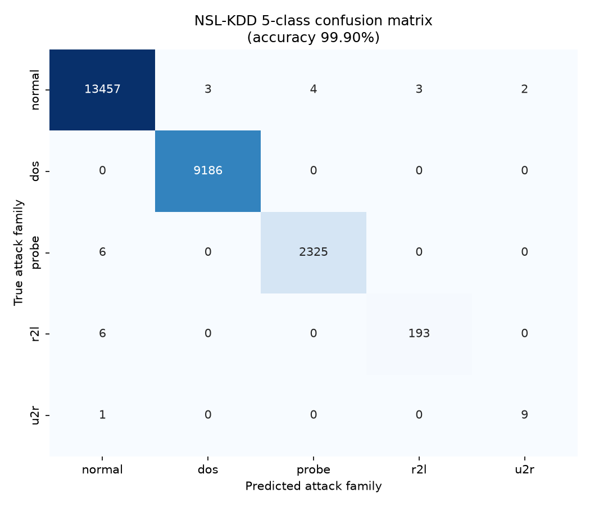
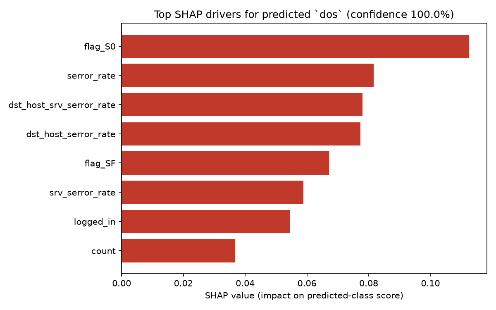

# AI-Powered SOC Assistant

An explainable AI triage pipeline that classifies NSL-KDD network connections into specific attack families, fuses supervised and unsupervised anomaly signals, and generates analyst-ready SOC incident tickets with GenAI.

[](https://github.com/opandey1/AI-SOC-Assistant/actions/workflows/ci.yml)
[](https://www.python.org/)
[](LICENSE)
[](https://www.unb.ca/cic/datasets/nsl.html)
[](https://colab.research.google.com/github/opandey1/AI-SOC-Assistant/blob/main/notebooks/AI_Powered_SOC_Assistant.ipynb)


> **Multi-class detection is the moat.** Unlike traditional binary "anomaly / not anomaly" SOC classifiers, this pipeline uses a native 5-class Random Forest to categorize specific attack families — **Normal, DoS, Probe, R2L, and U2R** — and explains every individual prediction with SHAP. That family-level verdict is what turns a raw alert into an actionable, triaged ticket.

## See It Run



## Why This Is Different

- **Native multi-class SOC detection:** Specific attack families (Normal, DoS, Probe, R2L, U2R) instead of a single binary anomaly flag.
- **Dual-model triage:** A Random Forest predicts the attack family while an Isolation Forest adds an unsupervised anomaly signal for suspicious traffic patterns.
- **Explainable evidence:** SHAP identifies the strongest feature drivers for each flagged connection and passes analyst-readable values into the ticket.
- **Local-first GenAI:** Ollama support lets the assistant generate tickets without sending raw network telemetry to an external LLM API.
- **Operational output:** The final response is a structured incident ticket with containment steps and copy-pasteable Splunk SPL queries.

## Results & Metrics

Evaluated on a **stratified 80/20 hold-out split of `KDDTrain+`** (SMOTE applied to the training fold only). Regenerate everything below with `python -m src.evaluate`.

| Attack family | Precision | Recall | F1-score | Support |
| --- | --- | --- | --- | --- |
| `normal` | 0.999 | 0.999 | 0.999 | 13,469 |
| `dos` | 1.000 | 1.000 | 1.000 | 9,186 |
| `probe` | 0.998 | 0.997 | 0.998 | 2,331 |
| `r2l` | 0.985 | 0.970 | 0.977 | 199 |
| `u2r` | 0.818 | 0.900 | 0.857 | 10 |

**Overall accuracy: 99.90% · Macro F1: 0.966 · Weighted F1: 0.999**



> **Honest generalization note.** `KDDTest+` is deliberately constructed to contain novel attack variants not present in training, so cross-distribution accuracy drops to **~74.9%** (macro F1 ~0.53), with recall on the rare `r2l` and `u2r` families being the hardest. Reproduce this harder evaluation with `python -m src.evaluate --use-test-set`. Closing that gap with richer features and multi-dataset validation (CICIDS2017, UNSW-NB15) is tracked as future work.

## Explainability in Action

For every flagged connection, SHAP ranks the features that drove the prediction and the pipeline forwards their **real, unscaled network values** (not z-scores) into the ticket. The example below is a textbook half-open SYN flood: `flag_S0` active with a 100% SYN-error rate.



Those drivers become plain-English evidence in the generated ticket:

```text
3. Why Flagged - Evidence
- flag_S0 was active, meaning connections were initiated but never acknowledged
  - the classic signature of a half-open SYN flood.
- serror_rate was 1.0, so every recent connection ended in a SYN error.
- dst_host_serror_rate / dst_host_srv_serror_rate were both 1.0 ...
```

See the full [sample ticket](docs/sample_ticket.md) and the underlying [SHAP evidence bundle](docs/shap_example_output.json).

## MITRE ATT&CK Mapping

Each detected attack family maps to a MITRE ATT&CK tactic, giving analysts a shared frame of reference for triage and escalation.

| Attack family | MITRE ATT&CK tactic | Tactic ID | Representative techniques |
| --- | --- | --- | --- |
| `dos` | Impact | [TA0040](https://attack.mitre.org/tactics/TA0040/) | Network Denial of Service (T1498), Endpoint DoS (T1499) |
| `probe` | Discovery | [TA0007](https://attack.mitre.org/tactics/TA0007/) | Network Service Scanning (T1046), System Network Discovery (T1016) |
| `r2l` | Initial Access | [TA0001](https://attack.mitre.org/tactics/TA0001/) | Valid Accounts (T1078), Exploit Public-Facing Application (T1190) |
| `u2r` | Privilege Escalation | [TA0004](https://attack.mitre.org/tactics/TA0004/) | Exploitation for Privilege Escalation (T1068), Abuse Elevation Control (T1548) |
| `normal` | — | — | Benign baseline traffic |

## Quickstart

```bash
git clone https://github.com/opandey1/AI-SOC-Assistant.git
cd AI-SOC-Assistant
python -m venv .venv
source .venv/bin/activate
pip install -r requirements.txt
```

Place `KDDTrain+.txt` and `KDDTest+.txt` in the repo root or `data/`, then run a no-LLM smoke test:

```bash
python src/pipeline.py --no-llm
```

To generate the ticket with a local Ollama model:

```bash
ollama pull mistral
SOC_LLM_PROVIDER=ollama python src/pipeline.py
```

PowerShell users can set the provider like this:

```powershell
$env:SOC_LLM_PROVIDER = "ollama"
python src/pipeline.py
```

Regenerate the metrics, confusion matrix, and SHAP artifacts:

```bash
python -m src.evaluate
```

### Run with Docker

A two-container stack runs the pipeline alongside a local Ollama server, so raw telemetry never leaves the host:

```bash
# Offline template path (no model required):
docker compose run --rm soc-assistant python src/pipeline.py --no-llm

# Full GenAI path with a local model:
docker compose up -d ollama
docker compose exec ollama ollama pull mistral
docker compose run --rm soc-assistant
```

### Tests

```bash
pip install pytest
pytest
```

## Repository Structure

```text
src/
  ingest.py       NSL-KDD loading and attack-family mapping
  preprocess.py   one-hot encoding, scaling, and SMOTE balancing
  train.py        Random Forest, Isolation Forest, and fused scoring
  explain.py      SHAP explanation bundle generation
  agent.py        LangGraph SOC analyst agent and threat-intel tools
  evaluate.py     metrics, confusion matrix, and SHAP artifact generation
  pipeline.py     runnable command-line pipeline
tests/            pytest unit tests for ingestion, preprocessing, SHAP, tickets
notebooks/
  AI_Powered_SOC_Assistant.ipynb
docs/             architecture, metrics, plots, and sample artifacts
.github/workflows/ci.yml   black + flake8 + pytest on every push
Dockerfile, docker-compose.yml
```

## Demo Artifacts

- [Architecture diagram](docs/soc_architecture.svg)
- [Animated pipeline demo](docs/demo.svg)
- [Confusion matrix](docs/confusion_matrix.png) and [per-class metrics](docs/metrics.md)
- [SHAP driver plot](docs/shap_drivers.png) and [SHAP evidence bundle](docs/shap_example_output.json)
- [Sample generated ticket](docs/sample_ticket.md)
- [Evolution brief](docs/SOC_Assistant_Evolution.pdf)
- [Colab notebook](notebooks/AI_Powered_SOC_Assistant.ipynb)

## Evolution & Wins

### 1. Feature Engineering: Robust Categorical Encoding

**Initial state:** The pipeline used `LabelEncoder` for categorical network features such as protocol, service, and flag.

**Challenge:** `LabelEncoder` creates false mathematical ordinals and can crash when live traffic introduces a category not seen during training.

**Fix:** The preprocessing pipeline now uses `OneHotEncoder(handle_unknown="ignore")`.

**Win:** The feature representation is mathematically sound and resilient to novel service values.

### 2. Agent Orchestration: Migrating to LangGraph

**Initial state:** The assistant logic relied on older LangChain agent patterns.

**Challenge:** Modern tool-calling workflows benefit from clearer state handling and more reliable agent execution.

**Fix:** The agent layer uses `langgraph.prebuilt.create_react_agent`.

**Win:** The orchestration layer is more maintainable and better aligned with current LangChain/LangGraph patterns.

### 3. Environment Constraints: Air-Gapped LLM Execution

**Initial state:** LLM usage was tied to cloud provider calls.

**Challenge:** SOC environments often restrict transmission of raw telemetry, internal IPs, and security logs to external APIs.

**Fix:** `initialize_llm` supports a provider factory with Ollama, OpenAI, Anthropic, and template modes, and the heavy LLM dependencies are imported lazily so the offline `--no-llm` path needs none of them.

**Win:** The pipeline can run locally with Ollama for privacy-sensitive demos and restricted environments.

### 4. Threat Intel Integration: Fault-Tolerant API Tools

**Initial state:** Threat-intelligence tools were placeholders.

**Challenge:** Real APIs can fail, rate-limit, or return verbose nested payloads that overwhelm the LLM context.

**Fix:** AbuseIPDB and NVD lookups use timeouts, explicit error handling, and compact response formatting.

**Win:** API failures become ticket context instead of Python process failures.

### 5. Explainable AI: Cross-Version SHAP Compatibility

**Initial state:** SHAP extraction assumed one output shape.

**Challenge:** SHAP has changed multi-class output formats across versions.

**Fix:** The explanation layer handles both legacy list outputs and newer 3D array outputs.

**Win:** The code is more portable across dependency versions.

### 6. Forensic Accuracy: Real-World Metrics

**Initial state:** The explanation bundle risked exposing scaled z-score values to the LLM.

**Challenge:** SOC analysts need real packet, byte, count, and rate values, not normalized model inputs.

**Fix:** Model inference still uses scaled values, while SHAP evidence includes the unscaled processed feature values.

**Win:** Generated tickets read like analyst evidence rather than model internals.

### 7. GenAI Guardrails: Eliminating Hallucinations & Over-Generation

**Initial state:** Smaller local models could drift into code snippets or raw floating-point SHAP values.

**Challenge:** The assistant must produce a tight incident ticket, not a generic explanation or script.

**Fix:** The system prompt enforces ticket-only output, structured sections, exact Splunk SPL code blocks, and a ban on raw SHAP float leakage.

**Win:** The GenAI layer translates model evidence into actionable SOC workflow output.
