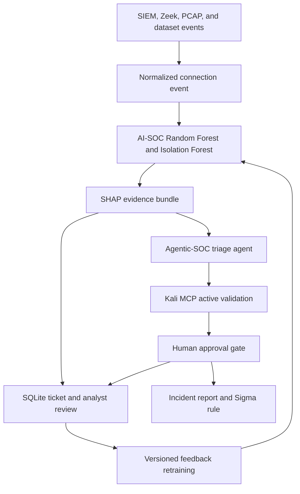

# Unified SOC Integration Roadmap

This repository is the explainable ML pre-triage layer of a planned Unified SOC system. The companion Agentic-SOC design supplies the investigation, active-validation, and detection-engineering layer. Its public repository has not been published yet; this document is the stable integration target until that happens.

## Integration Contract

The implemented boundary consists of four durable interfaces:

1. **Event input:** Kafka JSON envelopes from `src.streaming` carry `event_id`, timestamp, source IP, source name, and the 41 NSL-KDD-shaped model fields.
2. **Evidence output:** `src.runtime.ConnectionAnalysis` carries the fused verdict, Random Forest class/confidence, calibrated Isolation Forest risk, SHAP drivers, and generated ticket.
3. **Human verdicts:** `src.feedback` stores tickets idempotently and reviews append-only in SQLite, preserving the latest decision and its audit history.
4. **Model promotion:** `src.retrain` writes an atomic, versioned `ModelArtifact`; downstream services opt into that artifact explicitly.

## Delivery Sequence

| Phase | Deliverable | Acceptance gate |
|---|---|---|
| 1 | Zeek and Wazuh adapters emit the current Kafka envelope | Schema validation, replay fixture, dead-letter handling |
| 2 | MCP server exposes `score_connection`, `get_ticket`, and `record_review` | Authenticated tools, least privilege, audit log |
| 3 | Agentic-SOC consumes the SHAP bundle as grounded triage context | No unsupported evidence claims; deterministic fallback |
| 4 | Kali MCP performs bounded validation in an isolated lab | Explicit scope and analyst approval before active checks |
| 5 | Detection engineering proposes Sigma rules and incident reports | Human approval, syntax tests, rollback metadata |
| 6 | Reviewed outcomes enter controlled model promotion | Minimum cohort, held-out gate, drift checks, rollback |

## Security Boundaries

- Raw telemetry and evidence remain local by default; external LLM and threat-intelligence calls stay opt-in.
- MCP tools must expose narrow operations rather than arbitrary shell access.
- Active validation belongs in an isolated lab with explicit target allowlists.
- Model artifacts are trusted local files; never load an untrusted `joblib` artifact.
- A reviewed cohort must pass hold-out and cross-distribution gates before replacing a deployed model.

## Next Public Milestone

Publish the separate Agentic-SOC repository, add its immutable GitHub URL here, and implement the MCP contract against the event/evidence schemas already present in this project.
